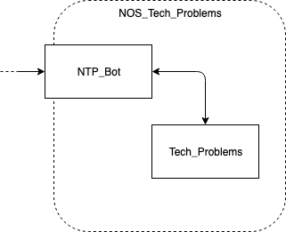

# Nos_Tech_Problems

## Table of Contents
* [What is it?](#what-is-it)
  - [Features](#features)
* [Usage](#usage)
  - [Development setup](#development-setup)
  - [Deployment](#deployment)
* [Architecture](#architecture)
  - [Overview](#overview)
  - [API](#api)


## What is it?
NOS Tech Problems is a bot module that combines Natural Language Processing capabilities 
with a machine learning backend to provide technical assistance to users. By taking advantage
of past user interactions, whether with real/human assistants or with the bot module itself, it
improves the model's ability to provide accurate solutions to users problems.

## Usage

### Development Setup

#### Tech Problems
* Make sure you have `database_population.json` inside `static` folder.
* Change directory:
`cd Tech_Problems`
* Create a directory for the model necessary files:
`mkdir technical_problems/model_files/`
* Move your model files to that folder.
* Install *Django* dependencies:
`pip install -r requirements.txt --user`
* Create & migrate DB
```
./manage.py makemigrations
./manage.py migrate
```
* Import static data:
`./manage.py loaddata ../static/database_population.json`
* Run *Django* project:
`./manage.py runserver`

#### NTP_Bot

* Change directory:
`cd NTP_Bot`
* Install bot dependencies:
`pip install -r requirements.txt --user`
* Run the application:
`./app.py`

### Deployment

* Install Docker
* Pull `Tech_Problems` and `NTP_Bot`containers: 
```
docker pull pei1/nos_tech_problems:tech_problems
docker pull pei1/nos_tech_problems:ntp_bot
```
* Run both containers
```
docker run -p 5005:5005 pei1/nos_tech_problems:tech_problems
docker run -p 5004:5004 pei1/nos_tech_problems:ntp_bot
```


## Architecture
### Overview
The microservice is made up of two different sub-modules: 
- the NTP Bot, which is responsible for handling incoming client messages and responding
- the Tech Problems sub-module responsible for authenticating clients and proposing solutions to their problems

hence only the NTP Bot is publically exposed, handling all the interaction between the users and the underlying
system:



### API
The only public API endpoint provided by the NOS Tech Problems microservice is the one 
exposed by the [NTP Bot](NTP_Bot) however, the following list also includes the endpoints made
available by the [Tech Problems module](Tech_Problems) to ease future development.

#### NTP Bot
<details>
<summary>Public API endpoint that allows user interaction with the NTP Bot</summary>

```http
POST /solver
```

</details>

#### NOS Tech Problems
In order to authenticate users this module uses Django's authentication backend and Session management features, 
which requires all requests made to the API to take advantage of 
[HTTP sessions](https://developer.mozilla.org/en-US/docs/Web/HTTP/Session).

<details>
<summary>Create an HTTP Session for a (valid) user</summary>

```http
GET /problems/login?username=<>&password=<>
```

| Parameter | Type | Description |
| :--- | :--- | :--- |
| `username` | `string` | Username (telephone number) |
| `password` | `string` | Password (NIF) |

</details>

<details>
<summary>Clears a users session data</summary>

```http
GET /problems/logout
```
</details>

<details>
<summary>Checks whether a client has a contract for the given service</summary>

```http
GET /problems/client_has_service?servico=<>
```

| Parameter | Type | Description |
| :--- | :--- | :--- |
| `servico` | `string` | Internal description of a single ISP service |

</details>

<details>
<summary>Provides a solution for a problem described by the input parameters</summary>

```http
GET /problems/solve?sintoma=<>&tipificacao_tipo_1=<>&tipificacao_tipo_2=<>&tipificacao_tipo_3=<>
```

| Parameter | Type | Description |
| :--- | :--- | :--- |
| `sintoma` | `string` | Internal description of the problem's simptome |
| `tipificacao_tipo_1` | `string` | Problem Typification - Type 1 |
| `tipificacao_tipo_2` | `string` | Problem Typification - Type 2 |
| `tipificacao_tipo_3` | `string` | Problem Typification - Type 3 |

</details>

<details>
<summary>Register a new user/client in the NOS Tech Problems backend</summary>

```http
GET /problems/register?username=<>&password=<>&morada=<>&equipamentos=<>&tarifario=<>
```

| Parameter | Type | Description |
| :--- | :--- | :--- |
| `username` | `string` | Username (telephone number) |
| `password` | `string` | Password (NIF) |
| `morada` | `string` | Client's address |
| `equipamentos` | `string` | Client's devices that pertain to the ISP service |
| `tarifario` | `string` | Client's contracted tariff |
</details>
